# 📬 Reachinbox.Ai

A full-featured email management web application designed and developed from scratch. This project simulates an email client with streamlined communication workflows including login, inbox (Onebox), replying, shortcut support, and more.

---

## 🛠️ Features Implemented

1. **Login Page**
   - Supports Google login via `/google-login`.

2. **Onebox Screen**
   - Displays a list of email threads using `GET /onebox/list`.
   - Individual thread data fetched using `GET /onebox/:thread_id`.

3. **API Integration**
   - Fully integrated with the provided Postman [API collection](https://documenter.getpostman.com/view/30630244/2sA2rCTMKr#433eb613-e405-4239-9e2d-f20485b31b27).
   - Email threads can be deleted via `DELETE /onebox/:thread_id`.

4. **Keyboard Shortcuts**
   - Press `D` → Delete selected thread.
   - Press `R` → Open reply editor for selected thread.

5. **Custom Text Editor**
   - Built-in rich text editor with two custom buttons:
     - `SAVE`: Saves draft or content locally.
     - `Variables`: Opens a modal to insert dynamic variables into the message body.

6. **Reply Functionality**
   - Submit replies using `POST /reply/:thread_id`.
   - Payload includes `from`, `to`, `subject`, and `body` as HTML.

7. **Dark & Light Mode**
   - Toggle between themes to match user preferences.

---


<div align="left">
     
    <div style="padding-left: 20px">
        <h1 style="text-decoration: none; margin: 0; padding: 0; color: #666; font-weight: bold">
            reachninbox.ai 
        </h1>
    </div>
</div>

<br clear="both">

##  [Live Demo ](https://reachinbox-tau.vercel.app/onebox)
---

##  Application Showcase

<table>
    <tr>
    <td width="50%">
      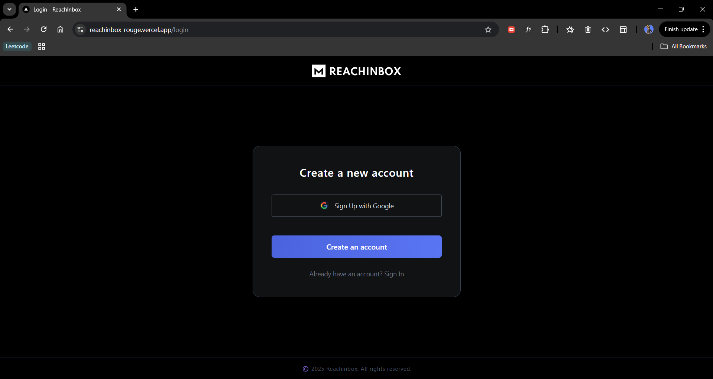
      <p align="center"><em>Login Page</em></p>
    </td>
    <td width="50%">
      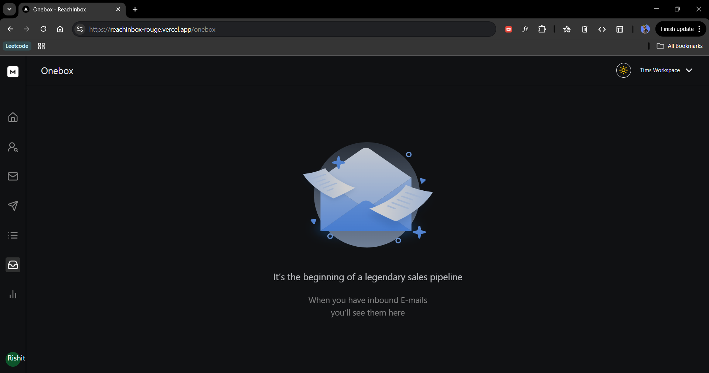
      <p align="center"><em>Empty Mail Box</em></p>
    </td>
  </tr>
  <tr>
    <td width="50%">
      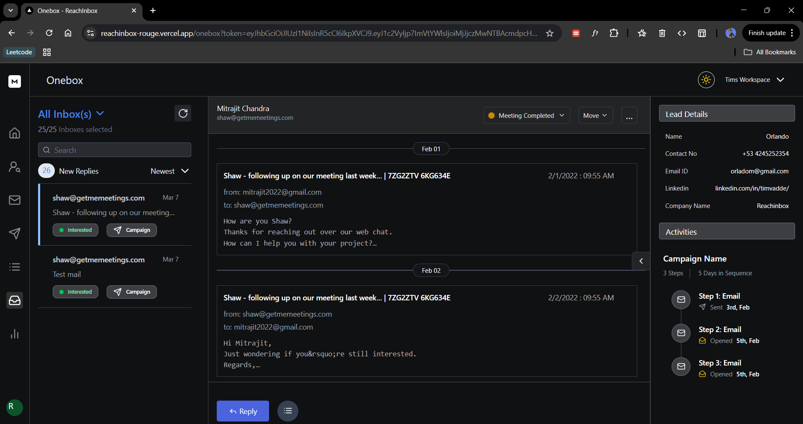
      <p align="center"><em>Onebox: Dark Theme</em></p>
    </td>
    <td width="50%">
      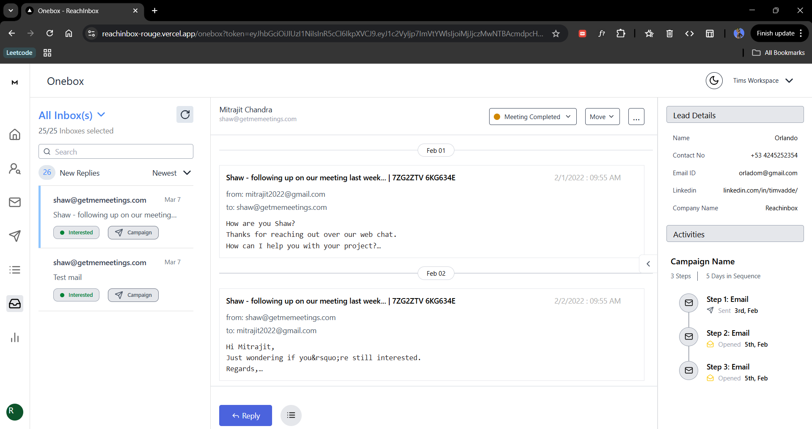
      <p align="center"><em>Onebox: Light Theme</em></p>
    </td>
  </tr>
  <tr>
    <td width="50%">
      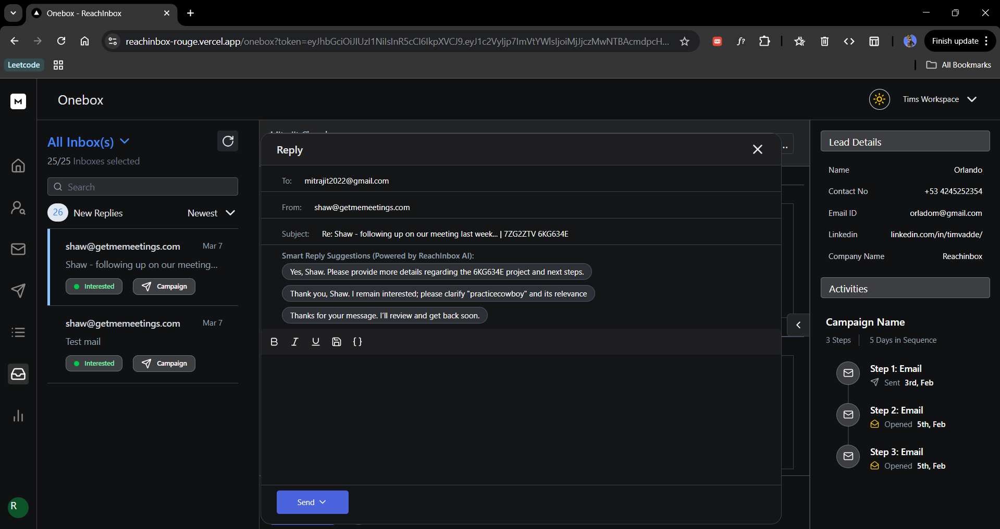
      <p align="center"><em>Reply Panel with R shortcut: Text Editor, AI replies</em></p>
    </td>
    <td width="50%">
      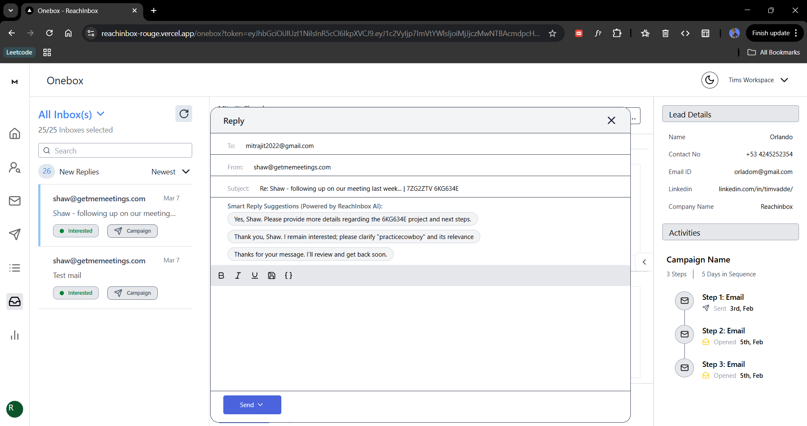
      <p align="center"><em>Reply Panel with R shortcut: Text Editor, AI replies</em></p>
    </td>
  </tr>
  <tr>
    <td width="50%">
      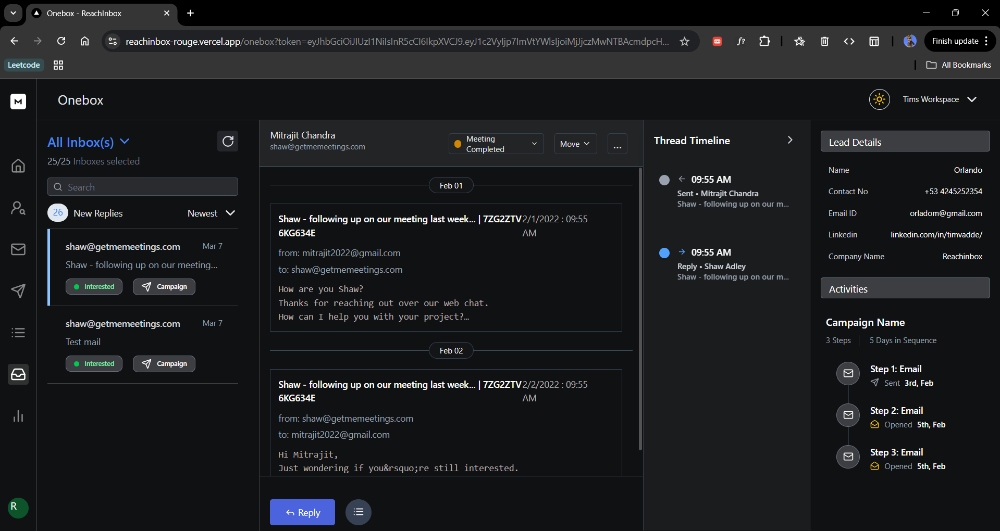
      <p align="center"><em>Thread Timeline with T shortcut: Tells conversations visually</em></p>
    </td>
    <td width="50%">
      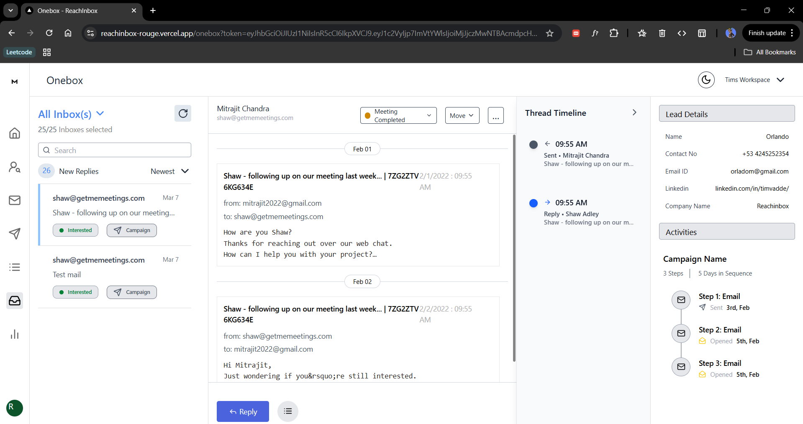
      <p align="center"><em>Thread Timeline with T shortcut: Tells conversations visually</em></p>
    </td>
  </tr>
   <tr>
    <td width="50%">
      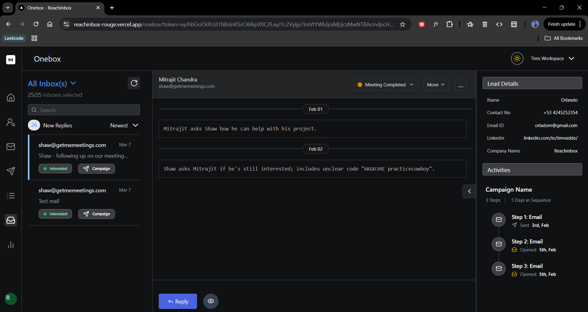
      <p align="center"><em>Summary switch with S shortcut: Shows summary of each mail</em></p>
    </td>
    <td width="50%">
      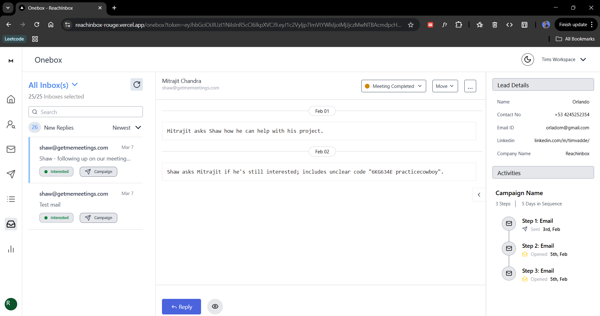
      <p align="center"><em>Summary switch with S shortcut: Shows summary of each mail</em></p>
    </td>
  </tr>
  <tr>
    <td width="50%">
      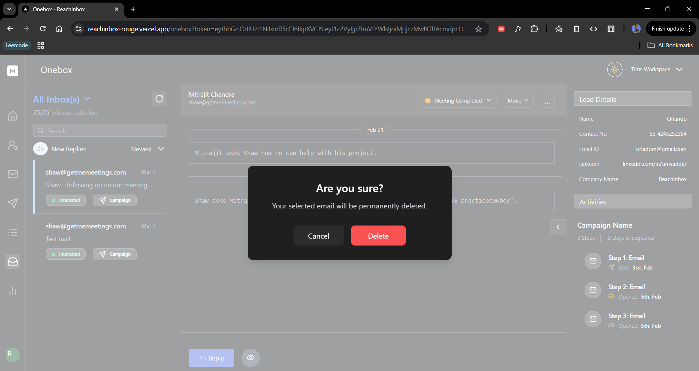
      <p align="center"><em>Delete popup with D shortcut</em></p>
    </td>
    <td width="50%">
      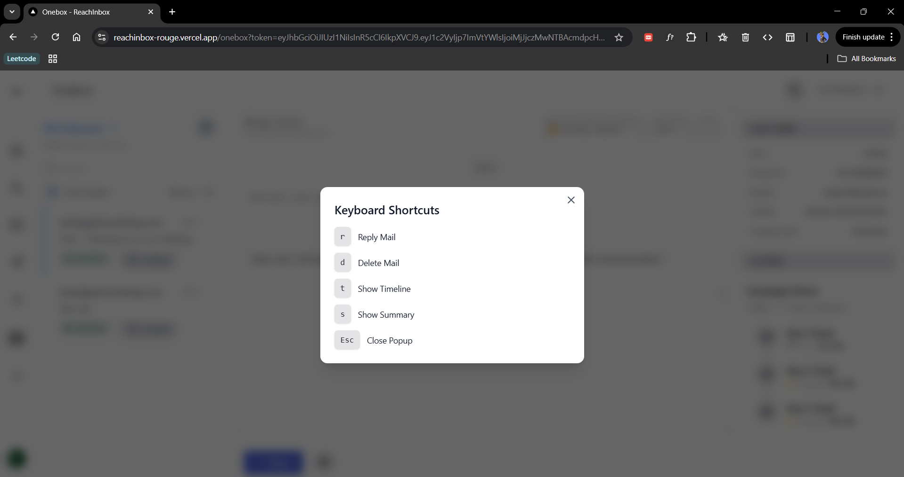
      <p align="center"><em>Popup showing shortcut with Ctrl + Shift + K similar to reachinbox site</em></p>
    </td>
  </tr>
</table>

---

## Additional Features

Hey there! Beyond the core requirements, I wanted to add some unique touches to make ReachInbox even more powerful and user-friendly. Here are three extra features I built, along with my thought process and how they add value to the app.

### 1. AI Smart Reply Suggestions in the Reply Panel

**What it is:**  
When you hit "R" to open the reply box, you’ll see three smart, AI-generated reply suggestions tailored to the email thread. These aren’t random—they’re context-aware and professional, ready to use with one click.

**Why I built it:**  
Replying to emails can take time, especially when you’re juggling lots of threads. I thought, “What if the AI could suggest quick, relevant replies?” It’s like having a smart assistant draft ideas for you.

**Where it’s shown:**  
In the SendReply component (bottom reply box) after pressing "R" on a thread.

**How it helps:**  
It saves time by giving you a head start on replies. You can tweak them or send them as-is, making outreach faster and less stressful.

**Value:**  
This boosts productivity for users managing high-volume cold outreach, aligning with ReachInbox’s goal of streamlining lead engagement.

<table>
  <tr>
    <td width="50%">
      
      <p align="center"><em>AI Smart Replies</em></p>
    </td>
    <td width="50%">
      
      <p align="center"><em>Reply Box with Suggestions</em></p>
    </td>
  </tr>
</table>

---

### 2. Visual Timeline with "T" Shortcut

**What it is:**  
Press "T" to slide out a cool timeline on the right side of the Onebox screen. It shows every email in the thread with icons (like arrows for replies or a paperclip for attachments) and lets you click to jump to any message.

**Why I built it:**  
Email threads can get long and messy, and I wanted a way to see the big picture without scrolling forever. A timeline felt like a fun, visual way to navigate conversations.

**Where it’s shown:**  
In the MiddlePannel.tsx component—toggle it with "T" to see the sidebar pop out.

**How it helps:**  
It makes finding key messages (like replies or files) super quick. No more digging through a thread—you just spot it on the timeline and jump right there.

**Value:**  
This adds a layer of clarity and control, perfect for users tracking multi-step outreach campaigns with prospects.

<table>
  <tr>
    <td width="50%">
      
      <p align="center"><em>Visual Timeline View</em></p>
    </td>
    <td width="50%">
      
      <p align="center"><em>Expanded Timeline Sidebar</em></p>
    </td>
  </tr>
</table>

---

### 3. Mail Summary Toggle with "S" Shortcut

**What it is:**  
Hit "S" (or click the toggle button in the footer) to switch between a detailed view of each email and a short summary. Summaries are AI-generated, giving you the gist in 10-15 words.

**Why I built it:**  
Sometimes you don’t need every detail—just the key points. I figured a summary mode would let users skim threads fast, especially when reviewing tons of leads.

**Where it’s shown:**  
In the MiddlePannel.tsx component—press "S" or use the List/Eye icon button to toggle views.

**How it helps:**  
It’s like a zoom lens for your inbox. Detailed mode is great for deep dives, while summary mode helps you process threads at a glance.

**Value:**  
This saves time and mental energy, making it easier to manage high-intent leads efficiently—a win for ReachInbox’s growth-focused mission.

<table>
  <tr>
    <td width="50%">
      
      <p align="center"><em>Summary Mode Enabled</em></p>
    </td>
    <td width="50%">
      
      <p align="center"><em>Detailed View Mode</em></p>
    </td>
  </tr>
</table>


##  Technology Stack

- Nextjs
- TailwindCss
- Axios

##  Setup Guide

```bash
# Clone the repository
git clone https://github.com/rounakbharti/Reachinbox.ai

# Navigate to project directory
cd reachinbox.ai

# Install dependencies
npm install

# Launch development server
npm run dev
```

Access the application at `http://localhost:3000`

##  Project Architecture

```
src/
├── app/
│   ├── (main)/
│   │   └── onebox/
│   │       ├── components/
│   │       │   ├── inbox/
│   │       │   └── reply/
│   │       ├── layout.tsx
│   │       └── page.tsx
│   ├── login/
│   │   ├── layout.tsx
│   │   └── page.tsx
│   ├── layout.tsx
│   ├── page.tsx
│   ├── middleware.ts
│   └── globals.css
├── components/
│   ├── Header.tsx
│   ├── Sidebar.tsx
│   ├── ShortcutPopup.tsx
│   ├── ThemeToggle.tsx
│   └── Icon.tsx
├── lib/
│   └── themeContext.tsx
├── services/
│   ├── aiServices.ts
│   └── mailService.ts
├── types/
│   └── mailTypes.ts

```
## Walkthrough

| Commit Message                               | Description                                                                 |
|---------------------------------------------|-----------------------------------------------------------------------------|
| Initial commit from Create Next App         | Started the project with base Next.js setup.                               |
| project setup with dark theme               | Configured dark theme and initial project structure.                       |
| onebox base layout                          | Set up foundational layout for the Onebox email client.                    |
| Sidebar and Header created                  | Created the main UI layout components.                                     |
| Left Panel - Inbox Header and Email Card    | Implemented left sidebar with inbox and email previews.                    |
| Middle Pannel - Header and Emails           | Built central panel to show list of emails and headers.                    |
| Right Panel - Lead Details and Activities   | Developed right panel showing selected email details and interactions.     |
| Added login ui and /google-login route      | Integrated authentication UI and Google login route.                       |
| Reply Popup ui and opening with r           | Added reply popup UI, triggered with 'r' shortcut.                         |
| Delete Mail                                 | Implemented functionality to delete emails.                                |
| Custom Text Editor - Save Draft, Variables  | Created a custom editor with draft saving and dynamic variable support.    |
| Empty Mails section                         | Handled UI for when there are no emails in a folder.                       |
| ui polish and added mail model              | Improved UI design and added mail model schema.                            |
| Additional Feature: Smart AI responses      | Integrated AI for smart email suggestions and replies.                     |
| thread timeline, mail summary               | Added threaded conversation timeline and mail summary feature.             |


##  Developer Profile

**Rounak Bharti**

[](https://github.com/rounakbharti/Reachinbox.ai)

---

